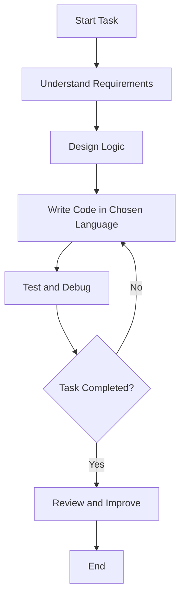

# Universal Programming Learning Framework

## Version
**1.0**

## Author
**You**

## Description
A YAML-based framework designed to teach programming fundamentals in any language. This framework includes structured logic, examples in multiple languages, and step-by-step guides for learners to build and understand core programming concepts.

---

## Pseudocode
### Description
Logical flow and language-agnostic representation of the task.

### Steps
1. **Setup**:
   - Initialize a simple environment.
   - Define input and output requirements.
   - Break down the task into logical steps.
2. **Core Logic**:
   - Process input based on defined rules.
   - Perform required operations (e.g., calculations, loops).
   - Handle edge cases effectively.
3. **Output**:
   - Display the result or return a value.
   - End gracefully.

---

## Multi-Language Examples
### Description
Same logic implemented in multiple programming languages.

#### Python Example:
```python
def greet(name):
    return f"Hello, {name}!"

print(greet("World"))
```

#### JavaScript Example:
```javascript
function greet(name) {
    return `Hello, ${name}!`;
}

console.log(greet("World"));
```

#### Java Example:
```java
public class HelloWorld {
    public static void main(String[] args) {
        System.out.println(greet("World"));
    }

    public static String greet(String name) {
        return "Hello, " + name + "!";
    }
}
```

#### C++ Example:
```cpp
#include <iostream>
using namespace std;

string greet(string name) {
    return "Hello, " + name + "!";
}

int main() {
    cout << greet("World") << endl;
    return 0;
}
```

#### Ruby Example:
```ruby
def greet(name)
  "Hello, #{name}!"
end

puts greet("World")
```

---

## Flowchart
### Description
General task flowchart for programming beginners.



---

## Programming Tasks
### Description
Exercises for learners to practice and reinforce programming concepts.

#### Task 1: Basic Input and Output
- **Objective:** Create a program that asks for a user's name and greets them.
- **Pseudocode:**
  1. Prompt user for their name.
  2. Store input in a variable.
  3. Print a greeting message using the variable.
- **Example Output:** `Hello, Alice!`

#### Task 2: Basic Arithmetic
- **Objective:** Write a program that adds two numbers entered by the user.
- **Pseudocode:**
  1. Prompt user for the first number.
  2. Prompt user for the second number.
  3. Add the two numbers together.
  4. Display the sum as the result.
- **Example Output:** `5 + 3 = 8`

#### Task 3: Loop Example
- **Objective:** Print numbers from 1 to 10 using a loop.
- **Pseudocode:**
  1. Initialize a counter variable to 1.
  2. While counter is less than or equal to 10:
     - Print the counter.
     - Increment the counter.

---

## Language-Switch Guidance
### Description
Guidance for adapting pseudocode into any language.

- **Python:** Use indentation for block structures.
- **JavaScript:** Use braces `{}` for blocks and semicolons for line termination.
- **Java:** Declare types explicitly and use classes where appropriate.
- **C++:** Use `#include` directives and specify `main` as the entry point.
- **Ruby:** Write concise, readable syntax without semicolons.

---

## Additional Features
### Description
Ideas to extend this YAML framework.

- Add tutorials for debugging in different languages.
- Include problem-solving strategies, e.g., divide-and-conquer.
- Provide sample projects for each language to apply learned concepts.

---

## How to Use
1. **Explore the Framework:** Understand the structure and navigate through the pseudocode, examples, and exercises.
2. **Start with Tasks:** Begin with the provided programming exercises and follow the pseudocode instructions.
3. **Pick a Language:** Use the multi-language examples as a reference to implement tasks in your chosen language.
4. **Follow the Flowchart:** Understand the general workflow for solving programming problems effectively.
5. **Experiment and Extend:** Add your own examples, tasks, or features to enhance the framework.

## Contribution
Feel free to fork this repository, suggest new features, or provide feedback to improve this learning framework. Contributions are welcome!
